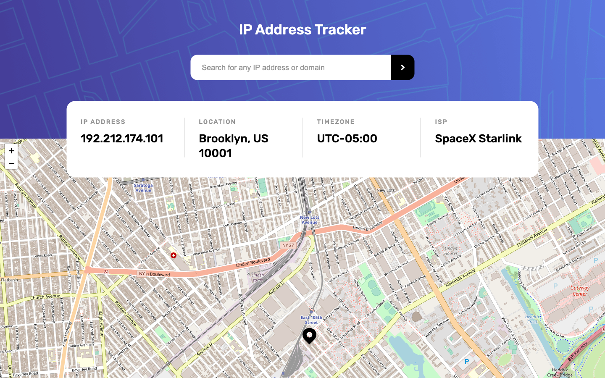

# Frontend Mentor - IP address tracker solution

This is a solution to the [IP address tracker challenge on Frontend Mentor](https://www.frontendmentor.io/challenges/ip-address-tracker-I8-0yYAH0). Frontend Mentor challenges help you improve your coding skills by building realistic projects.

## Table of contents

- [The challenge](#the-challenge)
- [Screenshot](#screenshot)
- [Links](#links)
- [Built with](#built-with)
- [What I learned](#what-i-learned)

## The challenge

1. Upon loading, the app will render user's current IP address and geolocation information.
2. Enter a valid IPv4 address or domain name, it will track the address's location, timezone and ISP.

## Screenshot

## Links

- Solution URL: [Add solution URL here](https://your-solution-url.com)
- Live Site URL: [Add live site URL here](https://your-live-site-url.com)

## Built with

- [LeafletJS:](https://leafletjs.com/index.html) to generate the map
- [IP Geolocation API by IPify:](https://geo.ipify.org/) to get IP address locations
- [Abstract API:](https://stackoverflow.com/questions/391979/how-to-get-clients-ip-address-using-javascript) to get client's IP address
- [Google Public DNS:](https://developers.google.com/speed/public-dns) to perform DNS lookup

## What I learned

- [How to change leaflet marker icon](youtube.com/watch?v=wnsEYm9hF0o)
- [How to get client's IP address](https://stackoverflow.com/questions/391979/how-to-get-clients-ip-address-using-javascript)
